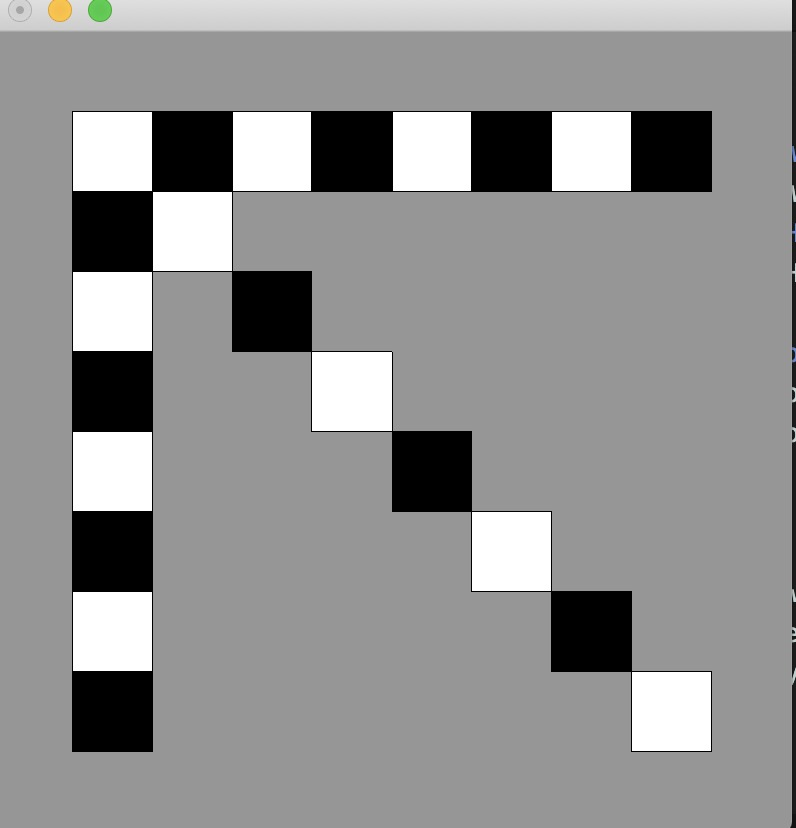
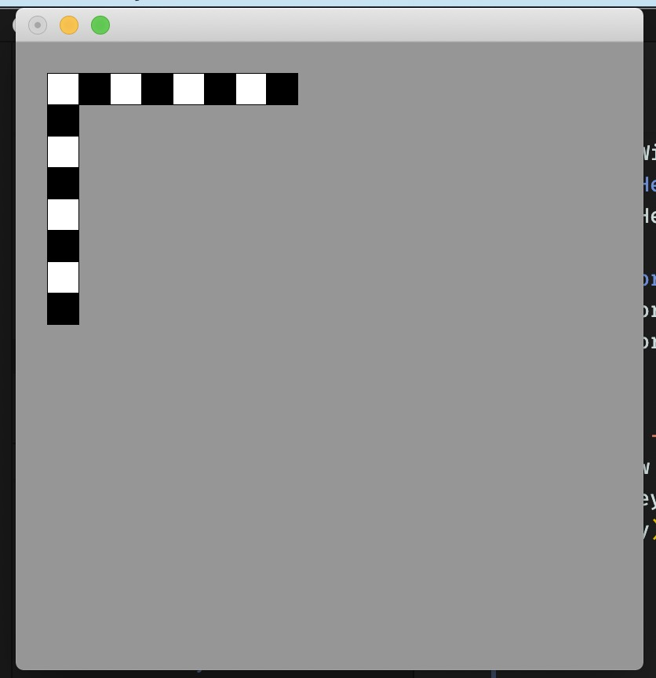
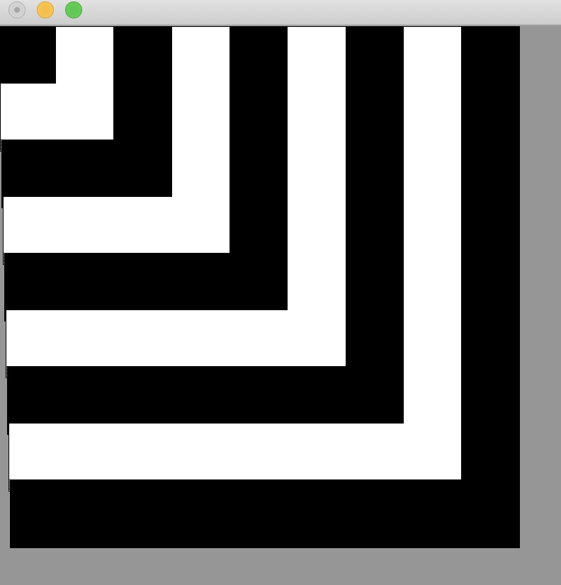
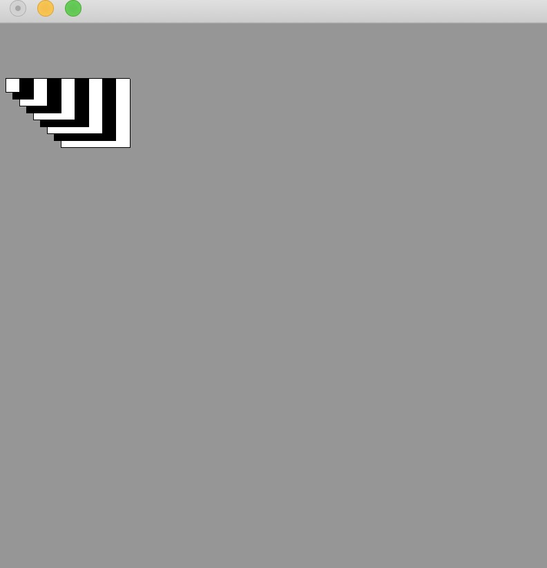
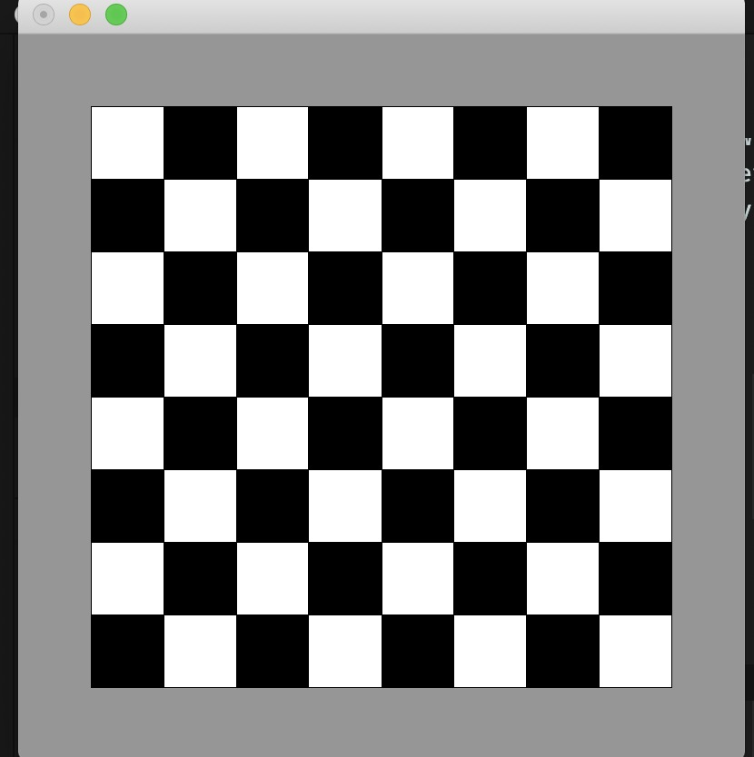
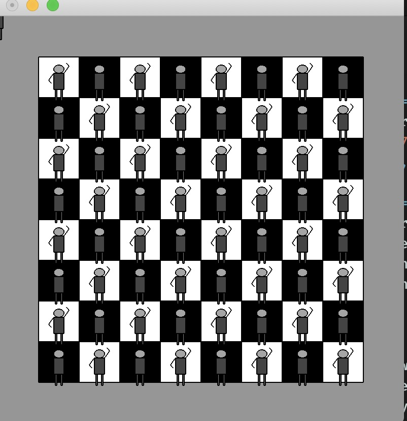
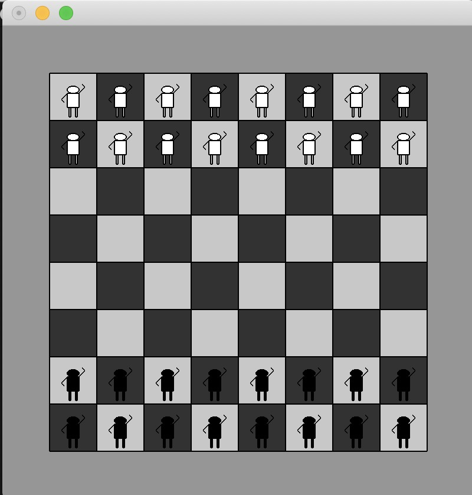
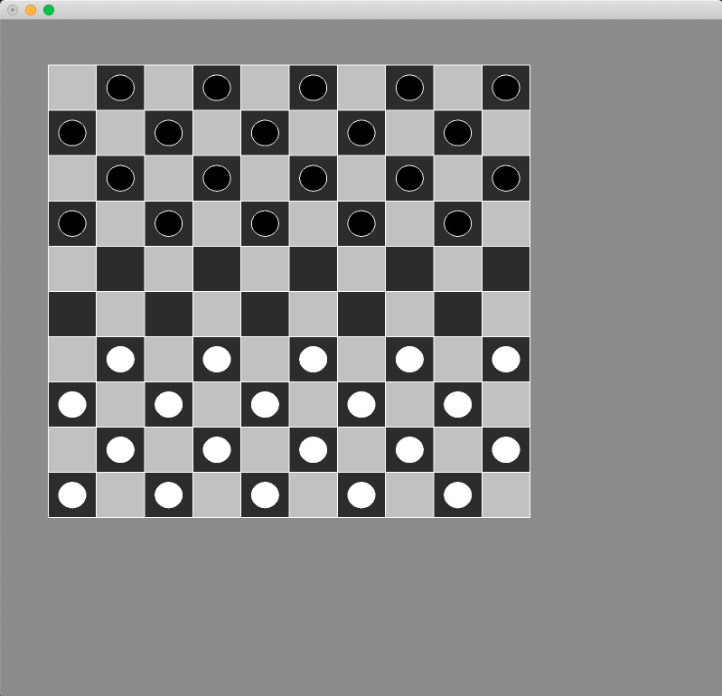

# Haskell (Functional programming paradigma)
## Inleiding
Tijdens het eerste en tweede jaar leerden wij programeren met het paradigma imperatief. In het eerste jaar vooral procedural, bijvoorbeeld in C heb ik met de arduino geprogrammeerd. Dit betekent dat het abstractie niveau laag is. Ik vertel doormiddel van code wat de code moet doen, om tot iets te komen. 

In het tweede jaar ben ik overgestapt van procedural naar object georienteerd. Het zijn beide imperatieve paradigma's wat niet meer of minder betekent dan dat ik de machine uitleg hoe het iets moet doen aan de hand van code. 

Het verschil tussen object georienteerd en procedural zit hem erin dat de groepering anders gedaan wordt.

Voor mij nu de uitdaging om over te gaan op een heel ander paradigma, namelijk decleratief. Dit komt deels overeen met SQL, waarin je beschrijft wat je wil in plaats van hoe je iets wil. Een declaratie betekent ook een aangifte, als in aangeven wat je wilt.

## Keuze programmeer taal
Mijn persoonlijke interesse ging uit naar Rust, dit is een vrij nieuwe programmeer taal met de focus op concurrency save en performance. Ondanks dat is mijn keuze gevallen op Haskell, omdat dit een unieke kans is om functioneel te programmeren. Haskell is dan wellicht niet de meest gebruikte functionele programmeer taal en heeft daardoor niet de grootste community, maar is wel de grondlegger van veel begrippen in functioneel programeren. Denk bijvoorbeeld aan Monads. Tenslotte is Haskell de enige taal die puur functioneel is. Het eerste criterium punt is hier dan ook doorslag geven in geweest.

|  Criteria | Clojure | Rust  | Erlang  | Haskell  |
|---|---|---|---|---|
| functioneel | +  | - | + | ++ |
| community  | +  | +  | -  | -  |
| documentatie  | +  | ++  | --  | +  |
| gebruikt in productie  | +  | +  | ++ *1* |  + |
| performance  | +  |  ++ | +  | + |
| snel te leren *2* |  ++ | +  | --  | --  |

*1* gebruikt in Whatsapp relevant voor het ASD-project

*2* overeenkomst met java & c#

## Dag 1 Haskell Onderzoek functioneel programeren

Blog functioneel haskell
Ik ben begonnen met lezen over wat functioneel programmeren precies inhoud tenopzichte van andere paradigma.
 So in purely functional languages, a function has no side-effects.

Ik heb onder andere de volgende YouTube video gekeken over dit onderwerp.
https://youtu.be/eis11j_iGMs

## Dag 2 Haskell Interactive shell

Vervolgens begon ik te lezen uit de gratis versie http://learnyouahaskell.com/chapters
Haskell won't execute functions and calculate things until it's really forced to show you a result. 

http://learnyouahaskell.com/starting-out
Ontdekken van de interactieve mode van haskell ghci, modules inladen met :l
DoubleMe functie samenlaten werken met double us
```haskell
doubleMe x = x + x
doubleUs x y = x * 2 + y * 2
```
```haskell
*Main> doubleUs 4 9 + doubleMe 123
272 = output
```
"Making basic functions that are obviously correct and then combining them into more complex functions. This way you also avoid repetition."

"if statement and if statements in imperative languages is that the else part is mandatory in Haskell."

 "We usually use ' to either denote a strict version of a function (one that isn't lazy) or a slightly modified version of a function or a variable."
```haskell
doubleSmallNumber' x = (if x > 100 then x else x*2) + 1  
conanO'Brien = "It's a-me, Conan O'Brien!"   
```

List samenvoegen kan alleen van hetzelfde type
*Main> "test" ++ [1,2]

<interactive>:32:12: error:
    • No instance for (Num Char) arising from the literal ‘1’
    • In the expression: 1
      In the second argument of ‘(++)’, namely ‘[1, 2]’
      In the expression: "test" ++ [1, 2]
*Main> 

Haskell intern voegt een lijst toe ++ door de hele lijst te doorlopen
dmv. : kan dit instant
*Main> 5:[1,2,3,4]
[5,1,2,3,4]
Nadeel is dat er geen array kan worden toegevoegd, slecht 1 int of char

Een element uit een lijst "Twan Bolwerk" !! 0
'T'


Array vergelijkingen First the heads are compared. If they are equal then the second elements are compared

*Main> [3,4] > [1,2]
True
*Main> [3,4] > [1,1000]
True
*Main> [3,4] > [10,1000]
False
*Main> [3,4] > [3,1000]
False
*Main> [3,400000] > [3,1000]
True


Array functies



elem takes a thing and a list of things and tells us if that thing is an element of the list. It's usually called as an infix function because it's easier to read that way.
* ghci> 4 `elem` [3,4,5,6]  
* True  
* ghci> 10 `elem` [3,4,5,6]  
* False 


Grappige manier om de lengte van de array te berekenen door gebruik te maken van zip en tuples bron : http://learnyouahaskell.com/starting-out#tuples
Prelude> fst (last (zip [1..] "dit is een test"))
15
Prelude> length "dit is een test"
15


## Dag 3 Haskell Opdrachten APP in haskell

Fibonacci Haskell vs java

Overeenkomsten: Beide maken gebruik van het data type Integer

2 manieren voor factorial
1ste is met guards
```haskell
fact :: Integer -> Integer
fact n | n == 0 = 1 | n /= 0 = n * fact(n -1)
```
Pattern matching

```haskell
factorial :: (Integral a) => a -> a  
factorial 0 = 1  
factorial n = n * factorial (n - 1)  
```

Quicksort with median of three in haskell

```haskell
centerOfArray :: [a] -> [a]
centerOfArray l@(_:_:_:_) = centerOfArray $ tail $ init l
centerOfArray l           = l

middleNumber :: (Ord n) => n -> n -> n -> n 
middleNumber x y z
    | x > y = middleNumber y x z
    | y > z = middleNumber x z y
    | otherwise = y

medianOfThree :: (Ord a) => [a] -> a
medianOfThree [] = error "Need atleast one item"
medianOfThree [a] = a
medianOfThree array =  middleNumber start center end
                        where start = head $ take 1 array
                              center = head $ take 1 (centerOfArray array)
                              end = head $ take 1 (drop (length $ init array) array)

quickSort3 :: (Ord a) => [a] -> [a]
quickSort3 [] = []
quickSort3 xs = quickSort3 lesser ++ sortedArray ++ quickSort3 greater 
      where
            pivot = medianOfThree xs
            sortedArray = [x | x <- xs, x == pivot]
            unsortedArray = [x | x <- xs, x /= pivot]
            lesser = filter (< pivot) unsortedArray
            greater = filter (>= pivot) unsortedArray
```

## Dag 4 Haskell Benchmark performance van quicksort
Importeren van packages, library zoals criterion een benchmarking tool.
prereqisites: cabal 

Genereer criterion benchmarks met:
[Benchmark genereren](Benchmark.hs)

$ cabal v2-run Benchmark.hs
### Benchmarking results: 


## Dag 5 Start uitdaging chess board
Het was even puzzelen voordat ik het goed had. Het lijkt simpel 2 dimensionale array met een boolean isWhite. Echter bleek dit toch net wat complexer in een functinele programmeer taal.






Hoe het werkt:
Recursie, recursie en recursie,
eerst teken ik het bord, het bord tekent een rij, de rij tekent een kolom. de kolom tekent de cel.
```haskell
drawBoard :: [a] -> Pio()
drawBoard ps = do 
  case ps of
    [] -> return ()
    _  -> do
      drawRow 10 10 screenWidth screenHeight 200
```
Tekenen rij
```haskell
drawRow :: Rows -> Cols -> Width -> Height -> Float -> Pio()
drawRow r c w h color | r <= 0 = drawCell Cell{player = Nothing,xCord =0,yCord =0, width = 0, height=0,backgroundColor=0} 
drawRow r c w h color | r > 0 = do
                             drawColumn r c widthCell heightCell color
                             drawRow (r-1) c w h (switchColor color)
                             where widthCell = calculateWidthCell
                                   heightCell= calculateHeightCell
```
Tekenen kolom
```haskell

drawColumn ::  Rows -> Cols -> Width -> Height -> Color -> Pio()
drawColumn r c widthCell heightCell color | c <= 0 = drawCell Cell{player = Nothing,xCord =0,yCord =0, width = 0, height=0,backgroundColor =0}
drawColumn r c widthCell heightCell color | c > 0 = do
                                drawCell Cell{player = playerOnCell r c, xCord=(rows * widthCell), yCord=(columns * heightCell),width= widthCell,height= heightCell,backgroundColor=color}
                                drawColumn r (c-1) widthCell heightCell (switchColor color)
                                where columns = fromIntegral c 
                                      rows = fromIntegral r
                                      playerOnCell r c = (calculatePlayerOnCell r c)
```
Tekenen cel
```haskell
drawCell :: Cell -> Pio ()
drawCell (Cell {player = p, xCord = x, yCord = y, width = w, height=h,backgroundColor=c}) = do
  fill(grey c)
  rect(x,y) (w,h)
  case p of
    Nothing -> circle 0 0
    Just White -> local $ do
      drawInCell x y w h
      scale (0.5, 0.5)
      drawDraught 255
    Just Black -> local $ do
      drawInCell x y w h
      scale (0.5, 0.5)
      drawDraught 0
```
Vervolgens tekent de cell een player, de player is een monad. Dit betekent dat het het gewoon een speler wit kan zijn of gewoon een speler zwart maar ook niks kan zijn. Just white, Just black or nothing.


## Dag 6 Start uitdaging chess pieces
Mijn intieele idee was om de pieces uit een afbeelding te halen. Helaas ondersteund de processing library van haskell dit niet. Het is alleen mogelijk omm simpele figuren te tekenen. Dit zou betekenen dat ik alle pieces moet tekenen in processing in haskell, terwijl ik liever eerst een werkend bord heb. 

Tekenen van een pion
```haskell
drawPawn c = do
	drawHead c
	drawBody c
	drawLegs c
	drawArms c

drawHead c= do	
	fill (grey c)	
	circle 10 (0, -20)

drawBody c= do
	fill (grey c)
	rect (-10, -10) (20, 40)

drawLegs c= do
	fill (grey c)	
	rect (-7, 30) (3, 27)
	rect (4, 30) (3, 27)
	
drawArms c= do
	fill (grey c)	
	strokeWeight 2
	linePath [(-10, -10), (-20, 7), (-15, 15)]
	linePath [(10, -10), (20, -27), (15, -35)]
```




Ik heb mijn uitdaging veranderd naar een dambord. Het is namelijk eenvoudiger om een circel te tekenen, damsteen bedoel ik. Zwaai de poppetjes maar gedag.


## Dag 7 Start uitdaging draught game

Tekenen van een draught (damsteen)
```haskell
drawDraught c = do
	fill (grey c)
	circle 30 (0, 0)
```
Om eenvoudig de begin opstelling te kunnen wijzigen heb ik een 2 dimensionale array gemaakt. Op basis van 0 1 of 2 wordt de kleur of leeg bepaald.
```haskell
calculatePlayerOnCell :: Rows -> Cols -> Maybe Player
calculatePlayerOnCell r c
  | isWhite (c,r) = Just White 
  | isBlack (c,r) = Just Black 
  | otherwise = Nothing

isWhite (c,r) = ((boardInitial !! (c-1)) !! (r-1)) == 1
isBlack (c,r) = ((boardInitial !! (c-1)) !! (r-1)) == 2


boardInitial = [
  [0,2,0,2,0,2,0,2,0,2],
  [2,0,2,0,2,0,2,0,2,0],
  [0,2,0,2,0,2,0,2,0,2],
  [2,0,2,0,2,0,2,0,2,0],
  [0,0,0,0,0,0,0,0,0,0],
  [0,0,0,0,0,0,0,0,0,0],
  [0,1,0,1,0,1,0,1,0,1],
  [1,0,1,0,1,0,1,0,1,0],
  [0,1,0,1,0,1,0,1,0,1],
  [1,0,1,0,1,0,1,0,1,0]]
  ```


## Dag 8 Movement in draught game

Functioneel programmeren betekent dat er geen state is. De toestand van het bord veranderd echter wel. Ik moet dit vertalen naar een oplossing in functioneel programmeren. Dit doe ik door een lijst bij te houden van alle punten die zijn aangeklikt. Op basis daarvan berekenen ik waar elke steen zou moeten staan.
```haskell
draw ps = do
	background (grey 150)
	drawBoard ps
  	case ps of
		[] -> return ()
		_  -> do
			 drawAllPoints ps
```
Circle 0 (0, 0) zodat er niks getekent wordt. Alsware een lege PIO, omdat het een PIO moet returnen. Hiervoor is eventueel een betere oplossing mogelijk.
```haskell
drawAllPoints [] = circle 0 (0,0)
drawAllPoints (p:pr:ps) = do
  fillColor pr
  circle 15 p
  drawAllPoints ps
drawAllPoints (p:ps) = drawAllPoints ps
```
Berekent op basis van de X en Y cordinaten welke cel het betreft.
```haskell
calculateCord (x,y) = (row ,col)
    where col = (x-calculateWidthCell/2) / calculateWidthCell
          row = (y-calculateHeightCell/2) / calculateHeightCell
```


Terminal run :
$ cabal v2-run 

Om het zelf uit te proberen. 

TODO: 

De pieces worden nu vanuit de initiele positie berekent. Deze veranderd natuurlijk als ik een piece 2 keer verplaats. Hier houdt de applicatie nu geen rekening mee. De lijst wordt daarnaast samen met de initiele positie getekent. Hierdoor lijkt het alsof de piece niet verplaatst wordt maar er 1 wordt toegevoegd. Dit is echter niet zo, aangezien de kleur van de piece wordt bepaald door het eerste punt. 

Ook moeten er nog spelregels worden toegevoegd. Een piece mag alleen links en naar rechts. Aan de kant van de opponent moet een piece geupgrade worden. 

Er moet een tegenstander (AI) komen, die gebruik maakt van het minimax algoritme. 

## Conclussie
Het functioneel programmeren kent een aantal handige technieken zoals pattern matching en guards. Dat het aantal lines of codes drastisch kan verminderen. Dit gaat wel vaak tenkosten van de leesbaarheid. Ik schrijf deze conclussie en een gedeelte van de blog nu achteraf. Ik merk dat ik nu al moeite heb om de code in êên oogopslag te begrijpen. Dit heb ik met een veel verbosere taal als Java of C# niet. Dit kan ook komen door het gebrek aan ervaring. Ik denk dat vooral voor tools als encryptie en bepaalde complexe pipelines waaraan weinig verandert zal worden functioneel programmeren een uitkomst kan bieden in termen van fout vermindering. 

Naast dat het lastig is om te begrijpen voor iemand die de code niet heeft geschreven, is er ook geen scope, zoals die van Java (private protected public). Dit maakt het werken in grote teams lastiger. Ook de ondersteuning laat soms te wensen over. Dit merkte ik al gauw met de package processing die helaas maar heel beperkte functionaliteit aanbied. Dit maakt haskell een stuk minder aantrekkelijk productie wise.
