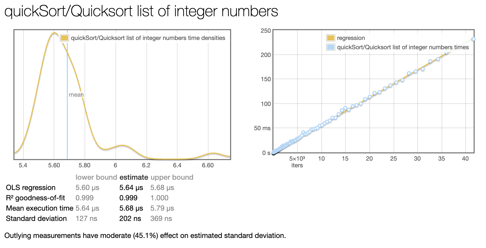

# haskellProject
## Dag 1 Haskell Onderzoek functioneel programeren

Blog functioneel haskell
Ik ben begonnen met lezen over wat functioneel programmeren precies inhoud tenopzichte van andere paradigma.
 So in purely functional languages, a function has no side-effects.

Ik heb onder andere de volgende YouTube video gekeken over dit onderwerp.
https://youtu.be/eis11j_iGMs

## Dag 2 Haskell Interactive shell

Vervolgens begon ik te lezen uit de gratis versie http://learnyouahaskell.com/chapters
Haskell won't execute functions and calculate things until it's really forced to show you a result. 

http://learnyouahaskell.com/starting-out
Ontdekken van de interactieve mode van haskell ghci, modules inladen met :l
DoubleMe functie samenlaten werken met double us
```haskell
doubleMe x = x + x
doubleUs x y = x * 2 + y * 2
```
```haskell
*Main> doubleUs 4 9 + doubleMe 123
272 = output
```
Making basic functions that are obviously correct and then combining them into more complex functions. This way you also avoid repetition.

if statement and if statements in imperative languages is that the else part is mandatory in Haskell.

 We usually use ' to either denote a strict version of a function (one that isn't lazy) or a slightly modified version of a function or a variable.
```haskell
doubleSmallNumber' x = (if x > 100 then x else x*2) + 1  
conanO'Brien = "It's a-me, Conan O'Brien!"   
```

List samenvoegen kan alleen van hetzelfde type
*Main> "test" ++ [1,2]

<interactive>:32:12: error:
    • No instance for (Num Char) arising from the literal ‘1’
    • In the expression: 1
      In the second argument of ‘(++)’, namely ‘[1, 2]’
      In the expression: "test" ++ [1, 2]
*Main> 

Haskell intern voegt een lijst toe ++ door de hele lijst te doorlopen
dmv. : kan dit instant
*Main> 5:[1,2,3,4]
[5,1,2,3,4]
Nadeel is dat er geen array kan worden toegevoegd, slecht 1 int of char

Een element uit een lijst "Twan Bolwerk" !! 0
'T'


Array vergelijkingen First the heads are compared. If they are equal then the second elements are compared

*Main> [3,4] > [1,2]
True
*Main> [3,4] > [1,1000]
True
*Main> [3,4] > [10,1000]
False
*Main> [3,4] > [3,1000]
False
*Main> [3,400000] > [3,1000]
True


Array functies



elem takes a thing and a list of things and tells us if that thing is an element of the list. It's usually called as an infix function because it's easier to read that way.
* ghci> 4 `elem` [3,4,5,6]  
* True  
* ghci> 10 `elem` [3,4,5,6]  
* False 


Grappige manier om de lengte van de array te berekenen door gebruik te maken van zip en tuples bron : http://learnyouahaskell.com/starting-out#tuples
Prelude> fst (last (zip [1..] "dit is een test"))
15
Prelude> length "dit is een test"
15


## Dag 3 Haskell Opdrachten APP in haskell

Fibonacci Haskell vs java

Overeenkomsten: Beide maken gebruik van het data type Integer

2 manieren voor factorial
1ste is met guards
```haskell
fact :: Integer -> Integer
fact n | n == 0 = 1 | n /= 0 = n * fact(n -1)
```
Pattern matching

```haskell
factorial :: (Integral a) => a -> a  
factorial 0 = 1  
factorial n = n * factorial (n - 1)  
```

Quicksort with median of three in haskell

```haskell
centerOfArray :: [a] -> [a]
centerOfArray l@(_:_:_:_) = centerOfArray $ tail $ init l
centerOfArray l           = l

middleNumber :: (Ord n) => n -> n -> n -> n 
middleNumber x y z
    | x > y = middleNumber y x z
    | y > z = middleNumber x z y
    | otherwise = y

medianOfThree :: (Ord a) => [a] -> a
medianOfThree [] = error "Need atleast one item"
medianOfThree [a] = a
medianOfThree array =  middleNumber start center end
                        where start = head $ take 1 array
                              center = head $ take 1 (centerOfArray array)
                              end = head $ take 1 (drop (length $ init array) array)

quickSort3 :: (Ord a) => [a] -> [a]
quickSort3 [] = []
quickSort3 xs = quickSort3 lesser ++ sortedArray ++ quickSort3 greater 
      where
            pivot = medianOfThree xs
            sortedArray = [x | x <- xs, x == pivot]
            unsortedArray = [x | x <- xs, x /= pivot]
            lesser = filter (< pivot) unsortedArray
            greater = filter (>= pivot) unsortedArray
```

## Dag 4 Haskell Benchmark performance van quicksort
### Benchmarking results: 





prereqisites: cabal 

Genereer criterion benchmarks met:
[Benchmark genereren](Benchmark.hs)

$ cabal v2-run Benchmark.hs